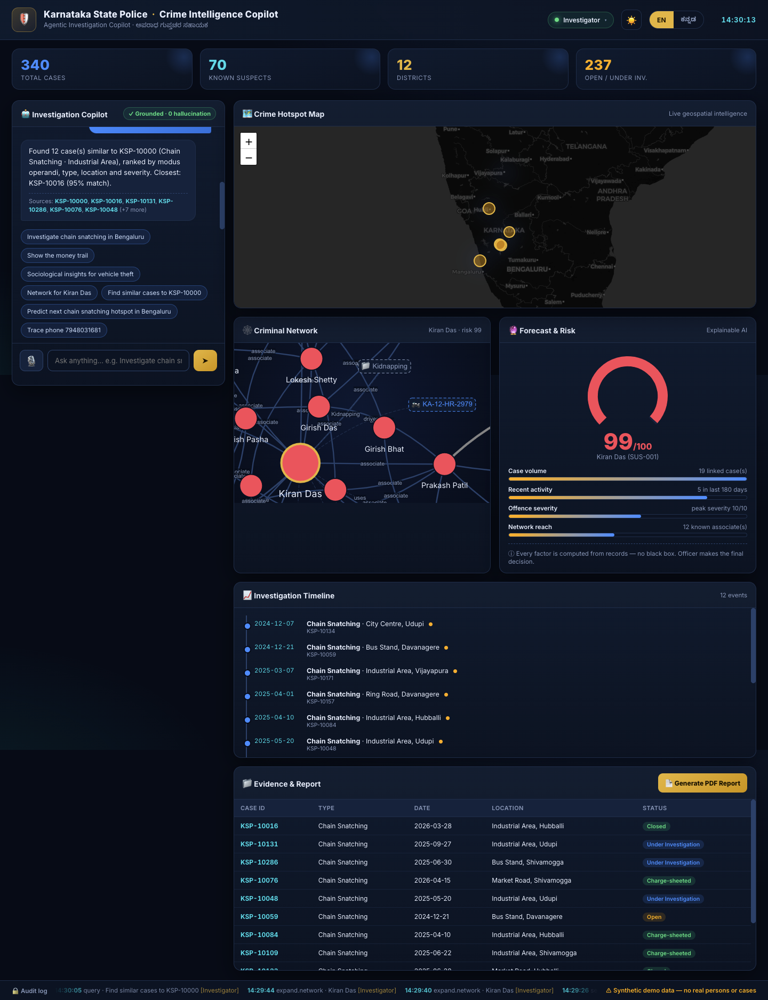
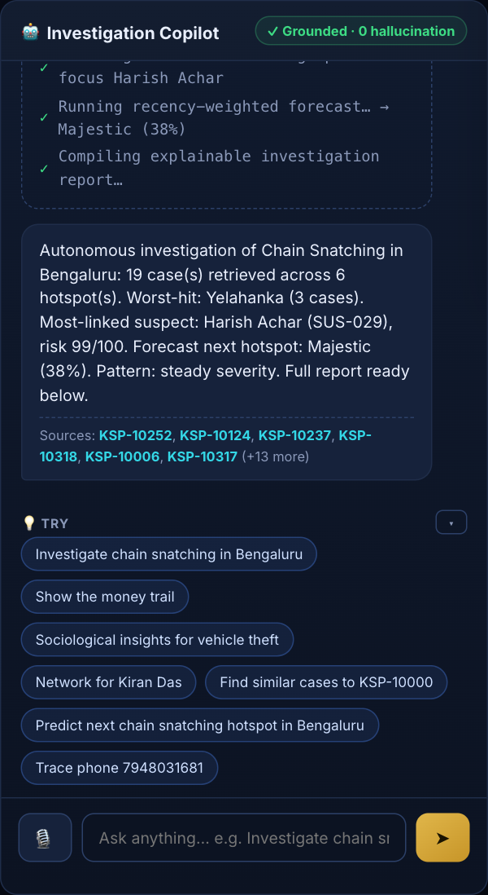
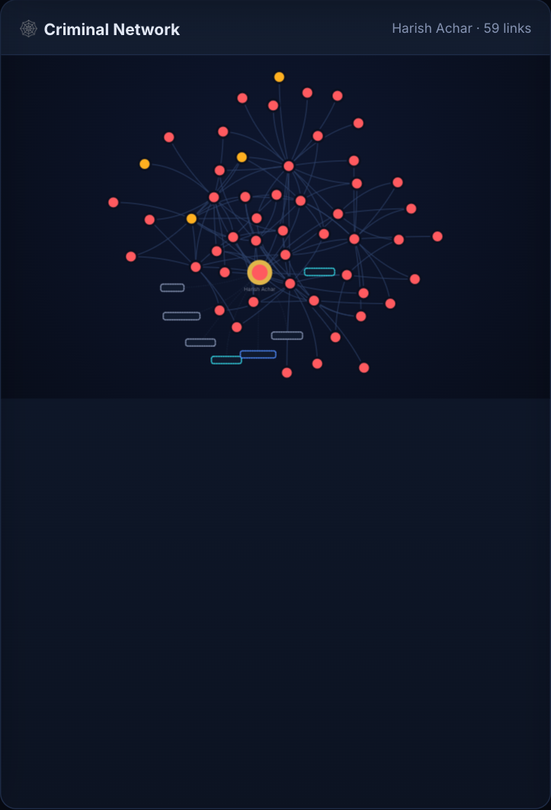
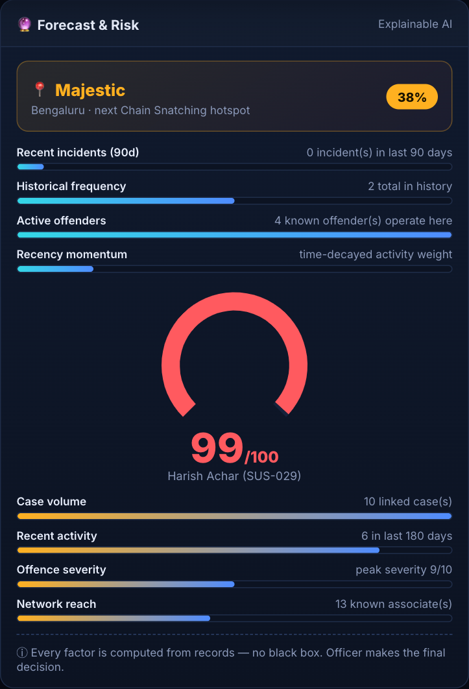
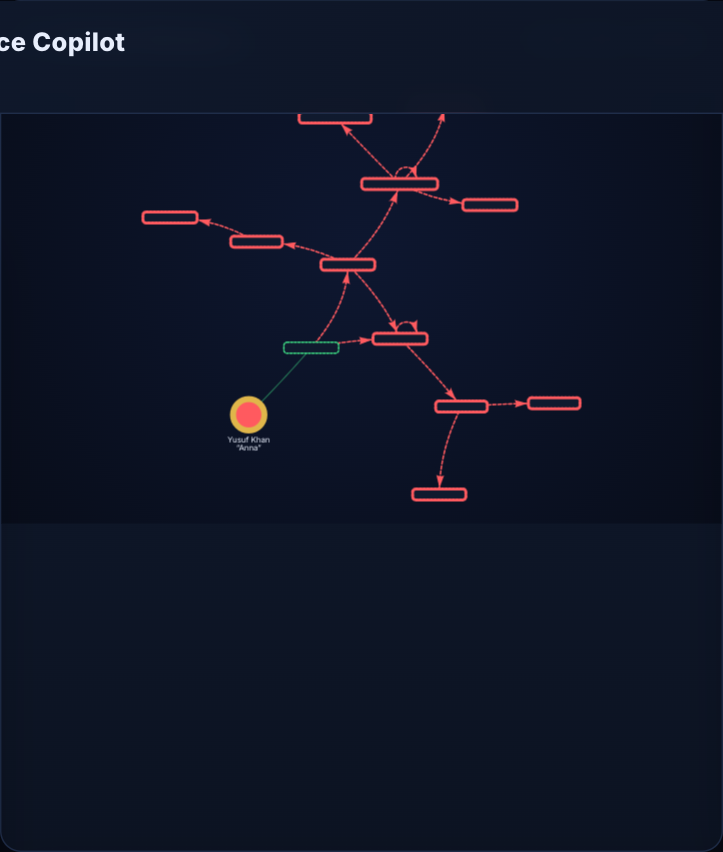
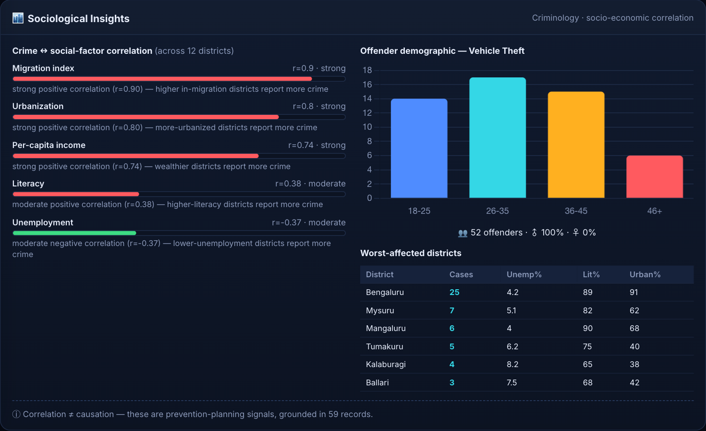
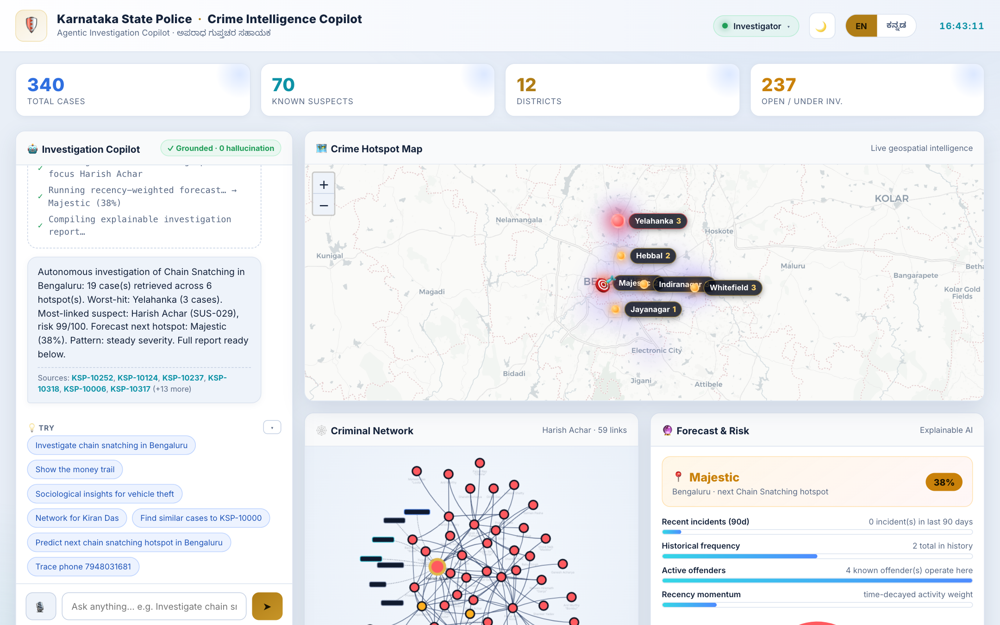

<div align="center">

# 🛡️ KSP Crime Intelligence Copilot

### An Agentic *Investigation Copilot* for the Karnataka State Police

**Datathon 2026 · Challenge 01 — Intelligent Conversational AI for the KSP Crime Database**

*Ask one question. Get the whole investigation — case search, criminal network, hotspot map, explainable forecast, money-trail, sociological insight, and a cited report. Grounded in records, zero hallucination, in English + ಕನ್ನಡ, with voice.*




<em>One screen: conversational copilot · live hotspot map · criminal network · explainable forecast & risk · investigation timeline · cited evidence + PDF report.</em>

</div>

---

## 📑 Table of contents
1. [Overview](#1-overview)
2. [Key features](#2-key-features)
3. [Screenshot gallery](#3-screenshot-gallery)
4. [The headline — Autonomous Investigation](#4-the-headline--autonomous-investigation)
5. [Quick start](#5-quick-start)
6. [Architecture](#6-architecture)
7. [Tech stack](#7-tech-stack)
8. [Coverage of the official 10-point problem statement](#8-coverage-of-the-official-10-point-problem-statement)
9. [Deployment on Catalyst (mandatory)](#9-deployment-on-catalyst-mandatory)
10. [Role-based access & governance](#10-role-based-access--governance)
11. [5-minute demo script](#11-5-minute-demo-script)
12. [Why this wins](#12-why-this-wins)
13. [Roadmap](#13-roadmap)
14. [Project status — honest limitations](#14-project-status--honest-limitations)
15. [Project structure](#15-project-structure)
16. [Ethics & data](#16-ethics--data)

---

## 1. Overview

Investigators today stitch together a case manually: search the database, find suspects, map where crimes cluster, draw the network by hand, guess the next hotspot, and write the report. It takes hours per case.

**KSP Crime Intelligence Copilot** collapses that into a single natural-language conversation. It is **not a chatbot** — it is an *agentic investigation copilot* that retrieves real records, builds the criminal network, maps hotspots, runs **explainable** forecasts and risk scores, traces money, surfaces sociological drivers, and generates a cited PDF — all from one question, in **English or ಕನ್ನಡ**, by text or voice.

The defining principle is **trust over fluency**: every figure is computed directly from records and every answer ships with the exact **case IDs** it used — *zero hallucination*, the non-negotiable for a law-enforcement product.

> ⚠️ This is a **working prototype** on **100% synthetic** Karnataka crime data. It runs entirely in the browser — no API keys, no backend — so it can't break on stage. The backend is also packaged for **Catalyst by Zoho** (see §9).

---

## 2. Key features

- 🤖 **Conversational copilot** — natural-language + voice queries, **context-aware follow-ups** ("predict the next one", "show their network"), bilingual EN/ಕನ್ನಡ.
- ✅ **Grounded answers with citations** — every claim links to `KSP-xxxxx` case IDs; zero hallucination.
- ⭐ **Autonomous Investigation** — one query runs the entire pipeline with visible step-by-step reasoning.
- 🗺️ **Crime hotspot map** — live heatmap with **area-labelled markers**, rich popups (top crime · latest case), a pulsing predicted-hotspot target, and theme-aware tiles.
- 🕸️ **Criminal network graph** — suspects ↔ associates ↔ phones ↔ vehicles ↔ cases; click to expand.
- 🔮 **Explainable forecast & risk** — recency-weighted hotspot prediction + suspect risk, **with the reasons** (no black box).
- 💸 **Financial money-trail** — accounts, layered mule-account detection, flagged transfers.
- 🏙️ **Sociological insights** — crime correlated with unemployment / literacy / urbanization / migration / income, plus offender demographics.
- 🔎 **Similar-case search** — ranked by modus operandi, type, location, severity.
- 📈 **Investigation timeline** — chronology with escalation-pattern detection.
- 📄 **One-click PDF report** — formatted, cited KSP investigation report.
- 🔐 **Role-based access + audit** — 4 roles, financial gating, PII masking, persistent audit log.
- 🌓 **Light / dark themes** + 🎙️ **voice** (Web Speech).

---

## 3. Screenshot gallery

<table>
<tr>
<td width="50%"><br><b>🤖 Conversational + Autonomous</b><br><sub>Step-by-step reasoning, every answer cited.</sub></td>
<td width="50%"><br><b>🕸️ Criminal Network</b><br><sub>Suspects, associates, phones, vehicles, cases.</sub></td>
</tr>
<tr>
<td width="50%"><br><b>🔮 Explainable Forecast & Risk</b><br><sub>Predictions and risk with the factors behind them.</sub></td>
<td width="50%"><br><b>💸 Financial Money-Trail</b><br><sub>Funds flowing through layered mule accounts.</sub></td>
</tr>
<tr>
<td width="50%"><br><b>🏙️ Sociological Insights</b><br><sub>Crime ↔ socio-economic correlation + demographics.</sub></td>
<td width="50%"><br><b>🌓 Light Theme</b><br><sub>Full light & dark theming, including theme-aware map tiles.</sub></td>
</tr>
</table>

> Full visual tour + function-by-function reference: **[DOCUMENTATION.md](DOCUMENTATION.md)**.

---

## 4. The headline — Autonomous Investigation

Type **"Investigate chain snatching in Bengaluru"** and the copilot runs the whole investigation itself, narrating each step as the panels fill:

```
✓ Parsing query → intent: investigate, crime: Chain Snatching, area: Bengaluru
✓ Retrieving matching records from crime database…
✓ → 19 case(s) retrieved and grounded
✓ Clustering geospatial hotspots… → 6 clusters
✓ Building criminal network graph… → focus Harish Achar
✓ Running recency-weighted forecast… → Majestic (38%)
✓ Compiling explainable investigation report…
```

That "do the whole thing from one sentence" moment — backed by citations — is what separates this from a Q&A bot.

---

## 5. Quick start

```bash
cd ~/Desktop/Datathon
./start.sh                 # opens http://localhost:8000 automatically
```
- macOS: you can also **double-click `start.command`** in Finder.
- Manual: `python3 serve.py` (or `python3 -m http.server 8000`), then open `http://localhost:8000`.
- Use **`localhost`** (not the `file://` path) so the microphone/voice works. No build step, no API keys.

**Try these:** `Investigate chain snatching in Bengaluru` · `Show the money trail` · `Sociological insights for vehicle theft` · `Network for <name>` · `Find similar cases to KSP-10000` · `Predict next chain snatching hotspot in Bengaluru` — then follow up with `predict the next one` / `show their network`.

---

## 6. Architecture

```
        ┌──────────────────── BROWSER (this prototype) ─────────────────────┐
Officer →│  Copilot UI · Voice (Web Speech) · EN/ಕನ್ನಡ · Light/Dark · RBAC  │
         │        │                                                          │
         │   parse()  ──►  intent + entities      (→ LLM in production)      │
         │        │                                                          │
         │   GROUNDED RETRIEVAL ENGINE  (engine.js — isomorphic)            │
         │   ├─ structured record retrieval        (+ source citations)      │
         │   ├─ geospatial hotspot clustering                                │
         │   ├─ criminal-network graph builder                               │
         │   ├─ recency-weighted forecast          (explainable)            │
         │   ├─ transparent risk model             (explainable)            │
         │   ├─ financial money-trail + mule detection                       │
         │   └─ sociological correlation + similar-case search               │
         │        │                                                          │
         │   Map · Graph · Charts · Timeline · PDF                           │
         └───────────────────────────────────────────────────────────────────┘
                                    │  same engine.js + data.js run in Node
                                    ▼
        ┌──────────────────── CATALYST BY ZOHO (deploy) ───────────────────┐
        │ Web Client Hosting · Serverless Functions · Data Store · QuickML   │
        │ (LLM+RAG) · Zia AutoML · Zia Voice · SmartBrowz · Auth · Circuits  │
        └───────────────────────────────────────────────────────────────────┘
```

**Why grounded retrieval instead of a raw LLM?** For policing, *verifiability* beats fluency. The engine computes every number from records and returns the source case IDs. In production only `parse()` is swapped for a **Catalyst QuickML LLM** that emits the same `{intent, entities}` — the verifiable retrieval layer is unchanged, so answers stay audit-able. The engine is **isomorphic**: the *same* `engine.js` powers the browser UI and a Catalyst Node Function (verified headless).

---

## 7. Tech stack

| Layer | Prototype (this repo) | Production (Catalyst) |
|---|---|---|
| Frontend | Vanilla JS · HTML5 · CSS3 (no build) | same → **Web Client Hosting** |
| Maps | Leaflet · Leaflet.heat · CARTO tiles | same |
| Graph / Charts | vis-network · Chart.js | same |
| PDF | jsPDF + AutoTable | **SmartBrowz** |
| Voice | Web Speech API | **Zia Services** (STT/TTS/translate) |
| NLU / "AI" | rule-based parser + grounded retrieval | **QuickML** (LLM + RAG) |
| Risk / forecast | transparent heuristics | **Zia AutoML** (with metrics) |
| Data | synthetic (`data.js`, isomorphic) | **Data Store** (FIR/CCTNS) |
| Backend | Node function (`catalyst/`) | **Serverless Functions** |
| Auth / audit | role logic + localStorage | **Authentication** + Data Store |

Fonts: Inter + Noto Sans Kannada. Zero runtime dependencies to install for the demo.

---

## 8. Coverage of the official 10-point problem statement

| # | Required pillar | In this prototype |
|---|---|---|
| 1 | Conversational interface (NL, EN/ಕನ್ನಡ, voice, **follow-up context**, history→PDF) | ✅ chat + voice + memory + cited answers |
| 2 | Criminal network & relationship analysis | ✅ interactive graph (suspect/victim/phone/vehicle/case) |
| 3 | Crime pattern & trend analytics | ✅ hotspot map + clusters + timeline *(seasonal: roadmap)* |
| 4 | **Sociological crime insights** | ✅ socio-economic correlations + demographics |
| 5 | Criminology offender profiling | ✅ repeat-offender + explainable risk score |
| 6 | Investigator decision support | ✅ summaries, timelines, **similar-case search**, leads |
| 7 | **Financial crime & transaction links** | ✅ money-trail, mule detection, flagged totals |
| 8 | Crime forecasting & early warning | ✅ recency-weighted forecast *(alerts via Cron: roadmap)* |
| 9 | Explainable AI & transparent analytics | ✅✅ citations + reasoning + factor bars |
| 10 | **Secure role-based access & governance** | ✅ 4 roles, financial gating, PII masking, audit log |

---

## 9. Deployment on Catalyst (mandatory)

Datathon 2026 **requires** deployment on Catalyst by Zoho, using Catalyst services where one exists. This repo ships a ready-to-deploy package in **`catalyst/`** and a full guide in **[CATALYST.md](CATALYST.md)**.

| Capability | Catalyst service | In repo |
|---|---|---|
| Static SPA | Web Client Hosting | ✅ `catalyst/client` |
| Backend API (reuses the engine) | Serverless Functions | ✅ `catalyst/functions/crime_api` |
| Crime DB (FIR, accused, victims, accounts) | Data Store | ✅ `catalyst/datastore/schema.sql` |
| Conversational AI + RAG + Kannada | QuickML (LLM + RAG) | ◻ integration point stubbed |
| Validated risk / forecast | Zia AutoML | ◻ stubbed |
| Voice (STT/TTS/translate) | Zia Services | ◻ stubbed |
| PDF / report | SmartBrowz | ◻ stubbed |
| Login + roles | Authentication | ✅ RBAC logic |
| Autonomous pipeline · alerts · events | Circuits · Cron · Signals | ◻ designed |

The backend Function was verified locally serving `/health`, `/stats`, and `/query` (with RBAC), reusing the **same engine** as the UI.

---

## 10. Role-based access & governance

Click the role badge to switch. Every query, role switch, and denied access is written to the persistent **audit log**.

| Role | Financial money-trail | Suspect names (PII) |
|---|---|---|
| **Investigator** | ✅ allowed | shown |
| **Analyst** | 🚫 blocked | shown |
| **Supervisor** | ✅ allowed | shown |
| **Policymaker** | 🚫 blocked | **masked** ("Subject") |

---

## 11. 5-minute demo script

1. **(0:00) Frame it** — "One question runs an entire investigation." Point to the live KPI strip.
2. **(0:30) The wow** — `Investigate chain snatching in Bengaluru`; narrate the reasoning as map, network, forecast, timeline fill.
3. **(1:45) Grounding** — highlight the **Sources: KSP-xxxxx** citations → "every claim is verifiable; zero hallucination."
4. **(2:30) Network** — click a suspect → graph expands to associates, phones, vehicles, cases.
5. **(3:15) Explainable AI** — show the forecast + risk **reason bars** → "no black box; the officer decides."
6. **(4:00) Depth** — `Show the money trail` (mule network) and `Sociological insights for vehicle theft`.
7. **(4:30) Bilingual + voice + report** — toggle **ಕನ್ನಡ**, speak a query, then **Generate PDF Report**.
8. **(4:50) Close** — "Grounded, explainable, bilingual, role-governed — and deployable on Catalyst."

---

## 12. Why this wins

- **Innovation** — agentic *autonomous investigation*, not a chatbot; language + graph + geo + finance + sociology in one flow.
- **Impact** — collapses a multi-hour manual workflow into one query; directly serves KSP investigators.
- **Technical depth** — grounded RAG with citations, graph intelligence, recency-weighted forecasting, transparent risk, money-trail detection, an isomorphic engine, and a Catalyst-native backend.
- **Scalability** — clean UI / NLU / retrieval split; swap synthetic DB → CCTNS and `parse()` → QuickML LLM with nothing else changing.
- **Presentation** — government-grade command-centre UI, live voice, bilingual, light/dark, and a PDF deliverable in hand.

---

## 13. Roadmap

- **Prototype (now)** — all 10 pillars on synthetic data; Catalyst package ready.
- **Pilot** — connect CCTNS/KSP data via Data Store; QuickML LLM + full Kannada; Zia voice; deploy on Catalyst.
- **Production** — Zia AutoML models with validation metrics; Circuits orchestration; Cron/Signals early-warning; semantic case search.
- **CrimeOS (startup)** — multi-state, CCTV/face/ANPR integration, predictive patrolling — an intelligence OS for Indian policing.

---

## 14. Project status — honest limitations

This is a **strong, working prototype** (genuinely top-tier on UI/UX, feature breadth, and explainability). In the interest of integrity, here is what is **not** yet done — the gap between this and a deployed, 1st-place-grade submission:

| Status | Item |
|---|---|
| ✅ Done | All 10 feature pillars, explainable AI, citations, themes, voice, RBAC, audit, PDF, isomorphic engine, Catalyst package + guide |
| 🟠 In progress | Real **LLM** (QuickML) for free-form/Kannada *input*; **Zia AutoML** models with accuracy metrics — integration points are stubbed |
| ◻ Pending (needs your account/data) | Actually running `catalyst deploy` (the mandatory gate); swapping synthetic data for the real KSP dataset; seasonal trends + early-warning alerts |

> The "AI" today is a **rule-based parser + grounded retrieval** (which keeps answers verifiable), architected so a Catalyst QuickML LLM drops in without changing the retrieval/citation layer.

---

## 15. Project structure

```
index.html · styles.css        UI shell + light/dark theme
data.js                        synthetic crime DB + transparent risk model   (isomorphic)
engine.js                      NLU + grounded retrieval + analytics engine    (isomorphic)
app.js                         UI orchestration (map · graph · voice · PDF · theme · RBAC)
serve.py · start.sh · start.command   local launch
catalyst/                      Catalyst deploy package (functions · datastore · client)
CATALYST.md                    deployment guide + feature → service mapping
DOCUMENTATION.md               full visual tour + function-by-function reference
Docs/                          KSP.png (hero) · screenshots/ · submission template
README.md                      this file
```

---

## 16. Ethics & data

All data is **100% synthetic and fictional**, generated deterministically in `data.js` — **no real persons, cases, phones, vehicles, or accounts**. The UI carries a persistent synthetic-data notice and an audit-log strip to model the privacy and accountability posture a real deployment requires.

<div align="center"><sub>Built for Datathon 2026 · Karnataka State Police × Hack2skill · Challenge 01</sub></div>
